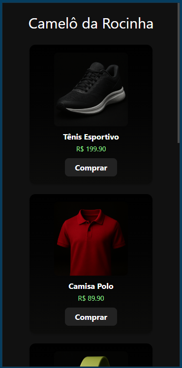
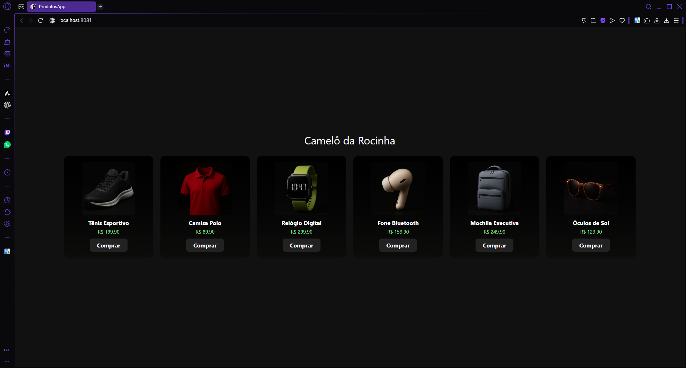

# ProdutosApp

Aplicativo criado com Expo (React Native) para exibir produtos em um formato de cartões reutilizáveis. Cada cartão mostra a imagem do produto, nome, preço e um botão de compra.

## Funcionalidades

- Lista de produtos com nome, preço e imagem
- Cartões reutilizáveis usando o componente `ProductCard`
- Botão "Comprar" que exibe um alerta personalizado
- Layout responsivo com bordas arredondadas e sombra

## Tecnologias Utilizadas

- React Native
- Expo CLI

## Como Executar o Projeto

1. Clone o repositório:

```bash
git clone https://github.com/serbiow/ProdutosApp
```

2. Acesse a pasta do projeto:

```bash
cd ProdutosApp
```

3. Instale as dependências:

```bash
npm install
```

4. Rode o projeto:

```bash
npx expo start
```


## Capturas de Tela




---

Desenvolvido para a atividade prática de componentes reutilizáveis.

